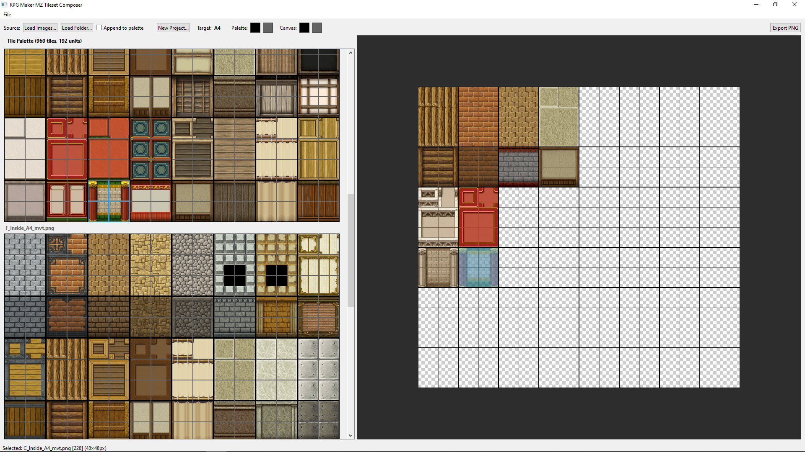

This software is provided as is, no guarantee or warranty of any kind. Backup your stuff before overriding anything, etc.

This is public domain, CC0 software.

# Tileset Composer for RPG Maker

Have you ever found yourself copying and pasting tiles from many different tileset files to create your own mashup? This tool aims to simplify that process.

## Features

- Understands the RPG Maker MV / MZ tileset formats (A1, A2, A3, A4, A5, B, C, D, E)
- Loads multiple tilesets file into a palette, and separate the palette by groups when dealing with autotiles (automatically detect their formats)
- Creates a grid for you in the format of your desired tile
- Lets you drag-and-drop tiles from the palette to your grid, on matching sizes (so a 2x3 autotile to a 2x3 slot on your grid).
- Lets you drag-and-drop tiles around your grid to re-arrange or remove them.
- Export your work to PNG, or open PNG files to work on them (automatically detect tileset format)

## Installation

### Method 1 (Binary):

Download the binary build from the [Releases](../../releases) page and run it.

### Method 2 (Source):

Check the file Getting Started - User.md for instruction on how to run locally. But basically: just set up venv, install dependencies with pip, and run.